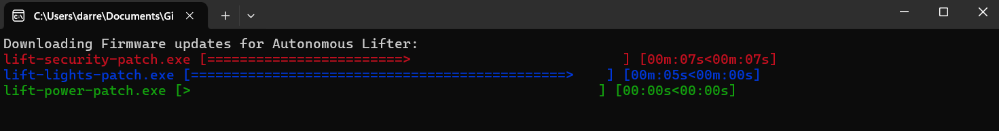

# C++ Multithreading Downloader

## Screenshot

## Overview

This project demonstrates a multithreaded file downloader in C++ using the `libcurl` library for HTTP requests and the `indicators` library for progress visualization. The application allows downloading multiple files concurrently with progress bars showing the download status for each file.

## Features

- **Multithreading**: Downloads multiple files simultaneously.
- **Progress Bars**: Visualizes download progress with customizable progress bars.
- **Random Colors**: Each progress bar is displayed in a randomly chosen color for clarity.

## Prerequisites

Before building and running the application, ensure that you have the following libraries installed:

- **libcurl**: For handling HTTP requests.
- **indicators**: For displaying progress bars.

### Installation

You can install the required libraries using package managers or by building them from source.
